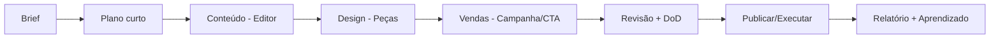

# Como Trabalhamos (ManaVitae)

> Criamos com arte. Entregamos com consciência. Sustentamos com método.

## Essência em 30 segundos

* **Foco:** resultado concreto com qualidade.
* **Como garantimos:** processo simples + documentação mínima + revisão.
* **Como você acompanha:** entregas por etapa, checklist de pronto e registro das decisões.

---

## O que o cliente recebe

* **Entregáveis claros** (texto, identidade visual, peças, landing, etc.).
* **Qualidade consistente** (padrões + revisão + DoD).
* **Rastreabilidade** (o que foi decidido, por quê, quando e por quem).
* **Evolução contínua** (melhorias quinzenais com base em dados e feedback).

---

## Papéis e responsabilidades

### 📝 Editor Supremo (Conteúdo e Direção Editorial)

Responsável por:

* definir tom, mensagem e estrutura final dos materiais.
* transformar informações brutas em conteúdo publicável.
* manter coerência entre peças (site, redes, apresentações, docs).
  Entregas típicas:
* textos finais, guidelines de linguagem, roteiros, headline/CTA, revisão.

### 🎨 Designer (Visual e Experiência)

Responsável por:

* identidade visual, layout e peças (social, banner, PDF, etc.).
* consistência visual (componentes, grid, tipografia, cores).
* adaptar o conteúdo para formatos (feed, stories, anúncio, apresentação).
  Entregas típicas:
* peças finais, templates, variações por canal, arquivos prontos para publicação.

### 📈 Analista de Vendas (Distribuição e Conversão)

Responsável por:

* organizar oferta, funil e argumentos (prova, benefício, objeções).
* transformar conteúdo/peças em **ação comercial** (campanhas e cadências).
* medir e retroalimentar o time com dados (o que converte / o que não converte).
  Entregas típicas:
* scripts, mensagens, cadência, matriz de objeções, plano de campanha, relatório.

---

## Fluxo de trabalho (simples e rastreável)

1. **Brief / Demanda**

* objetivo, público, canal, prazo e “definição de sucesso”.
* referência do propósito (quando existir): `docs/motivo.md`.

2. **Plano curto**

* lista do que será entregue, responsável por etapa e checkpoints.

3. **Produção**

* Editor cria/ajusta conteúdo.
* Designer converte em peças e versões.
* Vendas prepara distribuição, CTA e cadência.

4. **Revisão**

* revisão final (conteúdo + visual + consistência + checklist).

5. **Publicação / Execução**

* subir, publicar, disparar campanha, acompanhar.

6. **Aprendizado**

* registrar o que funcionou, o que falhou e o próximo ajuste.

---

## Comunicação (objetiva e respeitosa)

* **Assíncrono (preferencial):** decisões e contexto ficam registrados.

  * Sempre com **resumo no topo** (3–6 linhas).
* **Mensagens curtas:** para destravar (WhatsApp / comentário no PR).
* **Síncrono curto:** quando houver nuance, conflito ou alta ambiguidade (com pauta).

**Acordo simples:** intenção explícita + contexto mínimo + prazo de resposta combinado.

---

## Ferramentas (sem inflar complexidade)

| Categoria        | Ferramenta                 | Para quê                       |
| ---------------- | -------------------------- | ------------------------------ |
| Versionamento    | Git + GitHub               | rastrear mudanças e aprovar PR |
| Comunicação      | WhatsApp + Issues          | velocidade com registro        |
| Fonte de verdade | Docs (README/ADRs/manuais) | alinhamento e histórico        |
| Stack/Processo   | `docs/engenharia.md`       | padrão oficial                 |

---

## Definition of Done (o que é “pronto”)

* ✅ atende o objetivo e o público definidos no brief
* ✅ revisão concluída (conteúdo + visual + consistência)
* ✅ versão final publicada/entregue no formato correto
* ✅ documentação mínima atualizada (mudanças e decisões relevantes)
* ✅ próximos passos e métricas definidos (quando aplicável)

---

## Saúde e sustentabilidade (sem perder compromisso)

* trabalhamos com autonomia e responsabilidade.
* prazos e combinados são respeitados.
* quando surgir risco (prazo/escopo), comunicamos cedo e ajustamos com clareza.

---

## Aprendizado contínuo (leve, mas real)

* identificar causa raiz (sem caça às bruxas)
* registrar decisão (ADR quando necessário)
* prevenir recorrência (ajuste de processo, checklist ou teste)
* compartilhar no lugar certo

> Trabalho consciente é: clareza + qualidade + entrega sustentável.