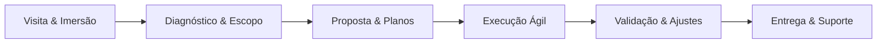

# Contrato com Cliente

### Fluxo completo de parceria

Visitamos, entendemos, desenhamos, construímos e sustentamos produtos digitais com transparência total.

---

## 🤝 Etapas da jornada

- **Visita/imersão**: entrevistas, entendimento das dores, definição de impacto e objetivos.
- **Diagnóstico**: requisitos funcionais e não funcionais, limites de escopo, riscos e dependências.
- **Proposta**: escolha de arquitetura/stack/cloud, plano de trabalho e modelo comercial adequado.
- **Execução**: Kanban transparente, rituais de alinhamento e registros em base compartilhada.
- **Validação**: testes, janela de correção e homologação conjunta.
- **Entrega & suporte**: documentação, repasse e possibilidade de contrato contínuo.

---

## 💼 Modelos comerciais

- :material-briefcase-outline: **Pacote por projeto**  
  Ideal para escopos bem definidos. Roadmap dividido em fases, com pagamentos por marco (descoberta, construção, lançamento).

- :material-clock-fast: **Banco de horas**  
  Perfeito para evoluções constantes. Horas pré-compradas com três níveis de complexidade:  
  **Essencial** (tarefas simples), **Avançado** (integrações/novas features) e **Crítico** (infra/segurança). Cada nível tem taxa e estimativa próprias.

- :material-shape-outline: **Modelo híbrido**  
  Combina MVP fechado + horas adicionais para discovery, experimentos e otimizações contínuas.

> Atividades extras (design, dados, DevOps, integrações) são detalhadas na proposta para evitar surpresas.

### Referências de investimento

| Modalidade | Valor-base | Observações |
| --- | --- | --- |
| Projeto (MVP focado) | R$ 18k – R$ 45k | Roadmap dividido em 50% (início) + 30% (meio) + 20% (entrega). 1,5 a 2,5 meses, ideal para validar rápido. |
| Projeto complexo / reescrita | R$ 45k – R$ 90k | Discovery + refatoração/migração. 3 a 5 meses, parcelado por releases menores. |
| Hora Essencial | R$ 100/h (pacote mínimo 12h) | Tarefas de ciclo curto (hotfix, ajustes rápidos, documentação). |
| Hora Avançada | R$ 150/h (pacote mínimo 10h) | Problemas de arquitetura, bugs complexos, integrações pesadas. |
| Hora Crítica | R$ 210/h (pacote mínimo 8h) | Falhas de produção, rebuilds, incidentes, inovação de infraestrutura. |

> Valores são ponto de partida para dar previsibilidade. Sempre validamos o esforço real antes de fechar o contrato para não cobrar além do necessário.

- :material-timer-sand: **MVP típico**  
  ~150h totais (maioria Essenciais) → 1,5 a 2,5 meses.

- :material-finance: **Reescritas**  
  250h a 420h combinando Essenciais/Avançadas/Críticas → 3 a 5 meses.

- :material-heart-outline: **Foco em valor**  
  Prioridade é resolver com o máximo possível de horas Essenciais para manter o investimento justo.

---

## 🧱 Seleção técnica e escopo vivo

- **Arquitetura & stack**: escolhemos tecnologias alinhadas ao problema, justificando trade-offs e custos operacionais.
- **Cloud & infraestrutura**: definimos ambiente (Heroku, GCP, Azure, AWS) de acordo com estágio, conformidade e budget.
- **Documentação**: ADRs, diagramas e handoffs fazem parte da entrega padrão.

=== "Escopo"
- Backlog inicial priorizado pelo cliente + dados da imersão.
- Limites claros para cada fase (descoberta, build, estabilização).
- Mudanças fora do escopo original viram novas histórias com custo adicional (tempo ou valor).

=== "Gestão"
- Kanban público (Linear/Jira/Trello) com status e responsáveis.
- Reuniões de alinhamento quinzenais e checkpoints ad-hoc quando surgem dúvidas.
- Todas as horas e tarefas registradas para auditoria e previsibilidade.

---

## 🔧 Execução e qualidade

| Pilar | Como garantimos |
| --- | --- |
| **Transparência** | Acesso compartilhado ao board, relatórios semanais e planilha de horas. |
| **Qualidade técnica** | Padrões da página de Engenharia (testes, revisão, observabilidade). |
| **Validação** | Testes funcionais + janela para correção de bugs antes do aceite final. |
| **Cultura ágil** | Planejamos em ciclos curtos, mantemos descobertas em paralelo à entrega. |

Durante a execução, posso atuar como **fullstack + DevOps**, mas tarefas adicionais são combinadas previamente para não gerar trabalho gratuito nem cobrança excessiva.

---

## 🧩 Equipes e expansão

- **Equipe principal**  
  Product/Tech lead (eu), responsável por discovery, arquitetura e entrega.

- **Reforços**  
  Possibilidade de trazer devs júnior/pleno para aumentar throughput. Custos e papéis descritos no contrato.

- **Parceiros**  
  Designers, especialistas em dados ou segurança podem ser acionados sob demanda com orçamento aprovado.

---

## 📑 Entrega, suporte e novas fases

1. **Entrega formal**: deploy, documentação, vídeo walkthrough e checklist final.  
2. **Janela de bugs**: período acordado para apontar issues; correções incluídas se forem regressões.  
3. **Suporte opcional**: planos mensais para manutenção, monitoramento e roadmap evolutivo.  
4. **Novos módulos/features**: passam por novo ciclo de imersão → proposta → execução, mantendo o histórico registrado.

### Planos de suporte pós-entrega

| Plano | Duração | Inclui | Investimento |
| --- | --- | --- | --- |
| **Estabilidade** | 30 dias (incluso) | Correção de bugs críticos, apoio em deploys, ajustes leves | Incluso no projeto |
| **Crescimento** | 3 meses | Monitoramento básico, 10h/mês Essenciais, reunião mensal | R$ 2.600/mês |
| **Evolução** | 6 meses | Monitoramento avançado, 20h/mês mistas (Essencial/Avançado), roadmap trimestral | R$ 4.800/mês |
| **Missão Crítica** | 12 meses | SLA 24h, 30h/mês (inclui horas Críticas), testes recorrentes, planejamento contínuo | R$ 8.200/mês |

Horas excedentes seguem os valores do banco de horas e são aprovadas antes da execução.

---

> Trabalhamos para multiplicar valor, nunca para cobrar além do necessário. Transparência, registro e diálogo constante mantêm a parceria saudável.

[Chame no WhatsApp para começar agora](https://api.whatsapp.com/send?phone=5512982772367&text=Quero%20conversar%20sobre%20contrato%20com%20cliente%20ManaVitae){ .md-button .md-button--primary }
