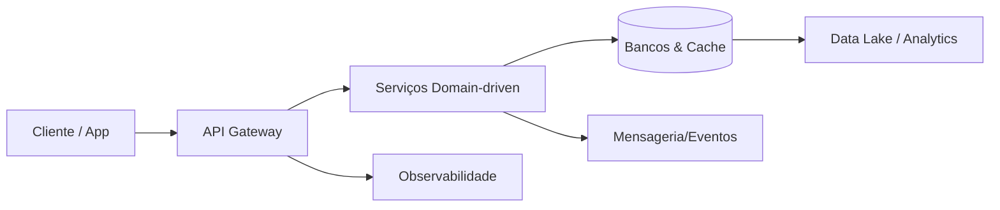

# Engenharia de Software

<div class="hero" markdown>

### Cultura técnica e estratégia da ManaVitae WareSoft

Construímos, mantemos e reescrevemos sistemas com rigor, estética e intenção — do discovery ao run.

</div>

---

## 🌌 North Star Técnica

<div class="grid cards" markdown>
- :material-diamond-stone: **Código vivo**  
  Estruturas pensadas para evoluir sem ruptura, com decisões registradas e rastreáveis.

- :material-palette: **Experiência elevada**  
  Interfaces funcionais → emocionais → futuristas, alinhadas ao [modo de criação](prompt-mestre.md).

- :material-rocket-launch: **Operação previsível**  
  Pipelines automatizados, métricas claras e segurança embutida desde o primeiro commit.
</div>

---

## 🛠️ Stack Estratégica

Tecnologias preferenciais para criação, manutenção e reescrita — sempre com intenção clara.

=== "Frontend"
| Tecnologia | Uso | Status |
| --- | --- | --- |
| Angular 20 | Web apps principais | ✅ Em uso |
| Angular 19 | Legados e protótipos | ✅ Em uso |
| Vue.js 3 | Projetos específicos | ✅ Em uso |
| PrimeNG | Componentes UI | ✅ Em uso |
| TailwindCSS | Styling expressivo | ✅ Em uso |
| Ionic | Apps híbridos | 📋 Planejado |

=== "Backend e APIs"
| Tecnologia | Uso | Status |
| --- | --- | --- |
| FastAPI | APIs Python | ✅ Em uso |
| Spring Boot | APIs Java | 📋 Planejado |
| Node.js / NestJS | APIs JavaScript/TypeScript | 📋 Planejado |

=== "Dados e Mensageria"
| Tecnologia | Função | Status |
| --- | --- | --- |
| PostgreSQL | Relacional principal | ✅ Em uso |
| MongoDB | NoSQL | 📋 Planejado |
| Redis | Cache / fila curta | 📋 Planejado |
| RabbitMQ | Message broker | 📋 Planejado |
| Kafka | Event streaming | 📋 Planejado |

=== "Infra, DevEx e Cloud"
| Tecnologia | Uso | Status |
| --- | --- | --- |
| Docker | Containerização | ✅ Em uso |
| Kubernetes | Orquestração | 📋 Planejado |
| GitHub Actions | CI/CD | ✅ Em uso |
| Git + GitHub | Versionamento | ✅ Em uso |
| Windsurf | IDE com IA | ✅ Em uso |
| Heroku / GitHub Pages | Deploy rápido | ✅ Em uso |
| Google Cloud | Serviços gerenciados | ✅ Em uso |
| Azure / AWS | Expansão | 📋 Planejado |

> Escolhemos stack pelo impacto na experiência e na manutenção — nunca por hype.

---

## 🧱 Arquitetura de Referência



- **Camadas claras**: apresentação → domínio → dados, com dependências unidirecionais.
- **Serviços opinativos**: focados em contexto de negócio, seguindo ADRs e guidelines.
- **Observabilidade integrada**: logs estruturados, métricas e tracing por padrão.

---

## 📚 Playbooks Técnicos

### Núcleo de Criação

=== "Frontend & UX"
    **Fundamentos essenciais** — Primeira impressão em 3-5s, cores/spacing guiando emoções e estados completos (hover, loading, erro, sucesso).  
    **Acessibilidade & performance** — Contraste ≥4.5:1, tipografia ≥16px, navegação por teclado/ARIA, skeletons, lazy loading, critical CSS.  
    > Todo produto segue design system com tokens e componentes customizados (PrimeNG + Tailwind como base).

=== "Código & Arquitetura"
    **Princípios** — Clean Code, SOLID, KISS, YAGNI, Separation of Concerns e Single Source of Truth. Type safety, baixo acoplamento, alta coesão e documentação pontual.  
    **Organização** — Estrutura por features/domínios; camadas apresentação → negócio → dados; Repository + Service Layer + Dependency Injection como padrão; Observer/Event emitters e factories para integrações.

=== "Workflow & Deploy"
    ```mermaid
    flowchart LR
        Ideia --> Backlog --> Sprint --> Dev --> CodeReview --> Deploy --> Learn
    ```
    - Git flow: `main → develop → feature/bugfix/hotfix`; commits `tipo: descrição`; code review obrigatório focando qualidade, segurança e UX.  
    ```mermaid
    flowchart LR
        Commit --> Tests --> Build --> DeployDev --> DeployStaging --> DeployProd
    ```
    - Dev espelha `develop`; homologação com QA; produção monitorada. Pipelines sempre rodam lint, testes, build e checagens de segurança.

### Sustentação Operacional

=== "Qualidade & Observabilidade"
    - Testes unitários, integração e E2E (metas 70% base / 90%+ regras críticas).  
    - README e registro de decisões em todos os projetos; APIs descritas (OpenAPI/Postman).  
    - Logs estruturados, métricas de performance/erros, alertas alinhados a SLOs.

=== "Segurança & Melhoria"
    - Zero secrets em repositórios (usar vaults/variáveis).  
    - Inputs validados/sanitizados, dependências atualizadas, auditorias IAM e backups testados.  

    | Ritual | Frequência | Propósito |
    | --- | --- | --- |
    | Retrospectiva | Quinzenal | Ajustar processos e acordos |
    | Métricas (lead time, bugs, cobertura) | Semanal | Visibilidade e foco |
    | Sessões técnicas | Mensal | Atualizar práticas e stack |
    | Pair / Mob programming | Quando útil | Transferir conhecimento |
    | Atualização do handbook | Sempre que algo muda | Garantir verdade única |

    > Este guia é vivo: evolui conforme aprendemos com projetos, parceiros e o ecossistema.
