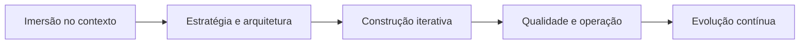

# ManaVitae WareSoft 🌿

### Software sob medida do primeiro insight ao crescimento sustentável

Criamos, mantemos e reescrevemos sistemas digitais que unem arte, engenharia e consciência. Entregamos produtos vivos, com documentação, operação e evolução contínua.

> Sua stack ganha propósito, performance e clareza estratégica.

[Veja como trabalhamos](como-trabalhamos.md){ .md-button .md-button--primary }
[Conhecer contrato](contrato-cliente.md){ .md-button }

---

## O que entregamos

- :material-lightbulb-on-outline: **Criação de sistemas**  
  MVPs, plataformas e produtos customizados. Discovery, arquitetura, design de experiência e desenvolvimento full-stack.

- :material-heart-pulse: **Manutenção ativa**  
  Sustentamos sistemas existentes com monitoramento, correções, otimizações e documentação viva.

- :material-sync: **Reescrita consciente**  
  Modernizamos código legado mantendo conhecimento do negócio. Refatoração guiada por métricas e ADRs.

---

## Nosso ciclo de parceria

Cada etapa é documentada no handbook para que você tenha transparência do processo, decisões e acordos de trabalho.

---

## Pacotes e resultados

| Pacote | Ideal para | Entregáveis principais |
| --- | --- | --- |
| **Seed** | Times em ideação ou MVP | Discovery guiado, backlog priorizado, protótipo navegável |
| **Grow** | Produtos em operação | Roadmap trimestral, squad híbrido, indicadores de saúde técnica |
| **Renew** | Sistemas legados e reescritas | Auditoria, plano de reescrita, refatorações por módulo |

> Medimos sucesso com qualidade, saúde do time e impacto de negócio — não só com deploys.

---

## Por que confiar

!!! info "Especialistas em fluxo completo"
    - Cada decisão de stack é registrada e compartilhada com o parceiro.
    - Guidelines vivas para Angular, Tailwind, PrimeNG e mais.
    - Cultura registrada em detalhes para alinhar time e parceiros.

!!! tip "Entrega com consciência"
    - Ritmo sustentável, sem sprints de burnout.
    - Processos com IA (Windsurf) para acelerar com qualidade.
    - Comunicação transparente e registros acessíveis.

---

## Explore o handbook

- :material-compass-outline: **Motivo**  
  [Sinta o porquê existimos](motivo.md)

- :material-handshake-outline: **Princípios**  
  [Regras vivas da nossa operação](principios.md)

- :material-fire-circle: **Como Trabalhamos**  
  [Processos, DoD e ritmo](como-trabalhamos.md)

- :material-rocket-launch-outline: **Crescimento**  
  [Onboarding, rituais e aprendizado](crescimento.md)

- :material-handshake: **Contrato com Cliente**  
  [Fluxo completo e planos](contrato-cliente.md)

- :material-chat-processing-outline: **Prompt-Mestre**  
  [Como usamos IA no dia a dia](prompt-mestre.md)

---

> _Construímos sistemas que respiram propósito, operam com clareza e evoluem junto com você._

[Agende uma conversa](https://api.whatsapp.com/send?phone=5512982772367&text=Quero%20saber%20mais%20sobre%20os%20servi%C3%A7os%20ManaVitae){ .md-button .md-button--primary }

