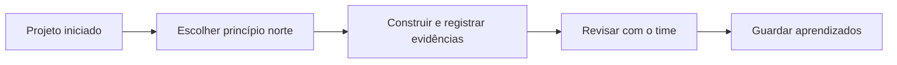

# Princípios da ManaVitae WareSoft

### Prática viva, não manual de regras

Cada princípio é um lembrete de como construímos software com saúde, beleza e consciência.

---

## 🧭 Como usar esses princípios

- :material-target: **Planejar**  
  Verifique o princípio antes de aceitar uma iniciativa. Se não couber, reescrevemos o escopo.

- :material-check-decagram: **Executar**  
  Durante o desenvolvimento, use os princípios como checklist para decisões técnicas e de UX.

- :material-flag-variant: **Encerrar**  
  No handoff, confirme qual princípio foi mais desafiado e registre aprendizados.

> Nenhuma entrega compensa ferir esses fundamentos. Se algo conflita, paramos e realinhamos.

---

## 🌿 Vida acima da pressa {#vida-acima-da-pressa}

!!! success "O que significa"
    - Ritmo humano acima de cronogramas artificiais.  
    - Pausas planejadas fazem parte da qualidade.  
    - Qualquer sinal de burnout dispara retrospectiva imediata.

**Aplicar no dia a dia**

- Negociar prazos realistas com clientes.  
- Usar horas extras como exceção registrada.  
- Acompanhar energia do time em rituais semanais.

---

## 💠 Empatia e consciência em cada ação {#empatia-e-consciencia-em-cada-acao}

!!! info "Perguntas de checagem"
    - Esta decisão respeita quem será impactado?  
    - Estou comunicando com clareza e sem jogos?  
    - Existe algum viés ou arrogância escondida?

**Aplicar no dia a dia**

- Feedbacks com intenção construtiva e dados.  
- Transparência sobre limitações ou incertezas.  
- Revisar mensagens importantes com a lente “como isso será sentido?”.

---

## 🔷 Qualidade é equilíbrio {#qualidade-e-equilibrio}

- **Técnica**  
  Código testável, arquitetura clara, observabilidade presente.

- **Estética**  
  Interfaces que emocionam sem poluir, microinterações cuidadas.

- **Energia**  
  Esforço na medida certa; nada de over-engineering ou gambiarras.

> O “feito” só vale quando técnica, estética e energia andam juntas.

---

## 🔁 Completar o ciclo {#completar-o-ciclo}

!!! tip "Checklist antes de encerrar"
    1. O problema inicial foi resolvido?  
    2. A documentação reflete o estado atual?  
    3. Existe plano claro de evolução ou monitoramento?  
    4. Alguém dependerá desta entrega? Já foi avisado?

Se qualquer resposta for “não”, o ciclo ainda não terminou.

---

## ⚖️ Harmonia entre tecnologia e ser humano {#harmonia-entre-tecnologia-e-ser-humano}

**Prática**

- Adotar convenções de acessibilidade e performance como padrão.  
- Usar IA e automações para aliviar, não sobrecarregar.  
- Participar ativamente do onboarding de clientes para alinhar expectativas.

> Tecnologia é extensão da intenção humana — se a energia estiver desalinhada, o produto denuncia.

---

## 💫 Cocriação com o usuário {#cocriacao-com-o-usuario}

É coautoria de verdade: testamos com usuários, abrimos canais de feedback e reagimos rápido.

- Workshops rápidos para validar fluxos.  
- Releases frequentes com métricas de adoção.  
- Histórias de usuário escritas com linguagem do cliente.

---

## 🔥 Evoluir com liberdade {#evoluir-com-liberdade}

!!! quote "Mantra"
    “Aprender o que não foi ensinado, libertar o pensamento e transformar aprendizado em criação viva.”

**Como manter vivo**

- Rotacionar responsabilidades e expor o time a novos desafios.  
- Reservar tempo semanal para estudo e experimentos.  
- Compartilhar falhas e acertos em sessões técnicas abertas.

---

## Ritual de revisão

> Estes princípios não são regras fixas, mas lembretes vivos: criar é um ato sagrado — técnico, humano e espiritual ao mesmo tempo.
